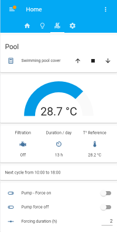
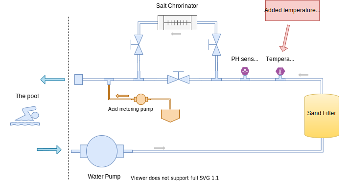
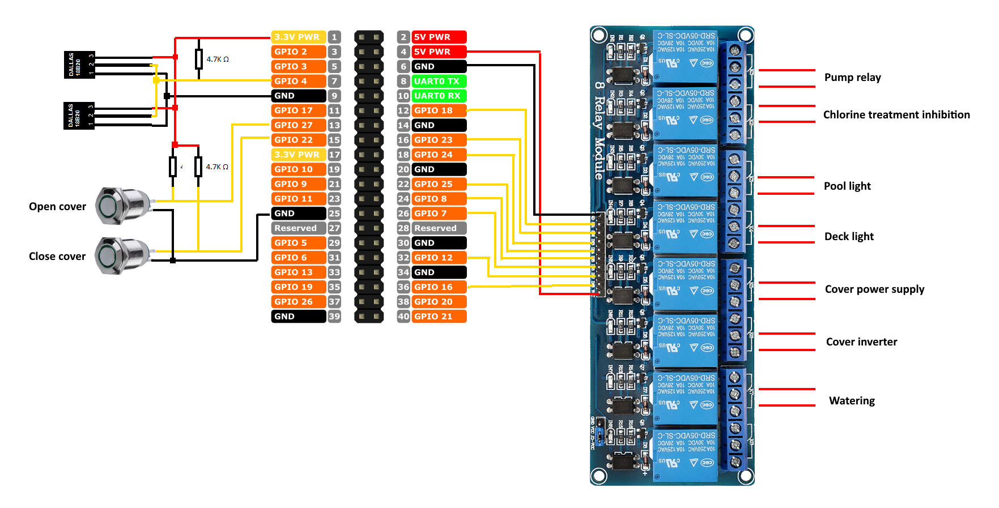
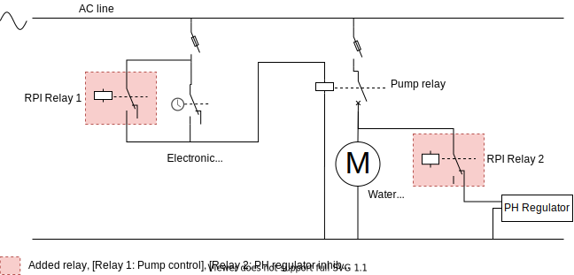
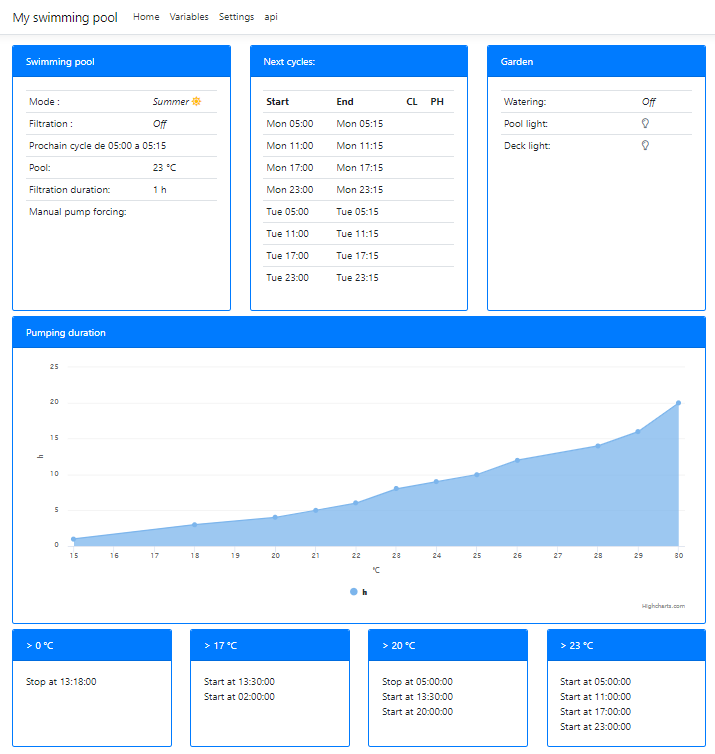

# Raspberry swimming pool control

The Rapsberry DotNET solution which automates your swimming pool !

Manages pump cycles depending on water temperature and protect your swimming pool during the winter against frost.
Web APIs enable integration with your favorite home automation system.


Example of integration in [Home assistant](https://www.home-assistant.io/).
See my [home assistant configuration example](doc/home-assistant-integration.md) file.



## The context

I don't want to spend a lot of time for setting up the water filtration and the treatments, minimum is the best :-).
The principle is to automatically adjust the pumping duration according the water temperature with few modifications of the existing system.
I decided to deploy a specific system instead of using my existing home automation installation, mainly for independence reasons, this system can completely operate without being connected.



The unique physical change consists in adding a temperature sensor (ds18b20) directly on the filtration system pipe. This temperature sensor measures the pool temperature after a significant pumping duration (usually 15 mins), and it is used during winter period as direct measure to switch on the pump in case of frost conditions.

For your convenience and if you don't want to upgrade your installation by making new hole in the pipe, you can use any other sensor temperature like RF433 swimming sensor temperature directly immersed in the water.

## The hardware

The system is using a Raspberry PI 3 with an 8 relays board and 2 ds18b20 sensors for temperature.

* Raspberry PI3 (or PI4), I used PI 3 B+ for this project.

* Case for raspberry on DIN Rail ([Amazon](https://www.amazon.com/GeeekPi-Case-Raspberry-Pi4-Rail/dp/B083916S3S/ref=sr_1_2?dchild=1&keywords=raspberry+din+rail+case&qid=1601238952&sr=8-2))

* 12v power supply on DIN Rail ([Amazon](https://www.amazon.com/MEAN-WELL-DR-15-5-DIN-Rail-Supply/dp/B005T6L33I/ref=sr_1_10?dchild=1&keywords=raspberry+pi+12v+power+supply+din+rail&qid=1601239065&sr=8-10))

* 5V 8-Channel Relay interface board

* 2 x ds18b20

The system controls:

* The pool pump

* The PH regulator

* The pool cover

* The pool light

* The deck light

* The watering system of the garden

## The Raspberry wiring

The 2 ds18b20 are connected to the GPIO 4 pin for 1 wire communications. The 2 push buttons used to operate the cover are connected to GPIO pins using a pull-up resistor. Relay board is power up with the 5V pin of the raspberry.



On the 8 channel relay module don't forget to set the jumper to use power provided by the VCC pin of the raspberry.

This wiring is shown as an example, you can use any GPIO pin to connect the relay module and the sensors because all I/O mappings are configurable in application JSON file.

## The pool electrical integration



As shown on the diagram, all added components allow the legacy system to continue working if the Raspberry controller fails, it just need to reactivate the electronic clock to pilot the pump.
The second added relay controls the PH Regulator, the regulator don't need to stay on during all the pumping cycle this is why it is controlled by the system, and for the same backup reasons, if Raspberry is down, the legacy system continue working normally.

## The inline water temperature sensor

A Npt 3/4 inch thermowell stainless steel cap with a ds18b20 temperature sensor inside has been added in the existing pipe close to the PH sensor.
No need to add a measure chamber, the temperature measure can be done directly in the water pipe.

This picture shows the mounting part.

## Prerequisite

You need a linux distribution deployed on your RPI system! I use raspbian 4.19.97 installed without UI and with only ssh enabled.

Activate 1-wire using raspi-config:

```powershell
sudo raspi-config
                                                                                                                                                                   │
   1 Change User Password Change password for the 'pi' user
   2 Network Options      Configure network settings
   3 Boot Options         Configure options for start-up
   4 Localisation Options Set up language and regional settings to match your location
 > 5 Interfacing Options  Configure connections to peripherals <
   6 Overclock            Configure overclocking for your Pi
   7 Advanced Options     Configure advanced settings
   8 Update               Update this tool to the latest version
   9 About raspi-config   Information about this configuration tool 

   P1 Camera      Enable/Disable connection to the Raspberry Pi Camera
   P2 SSH         Enable/Disable remote command line access to your Pi using SSH
   P3 VNC         Enable/Disable graphical remote access to your Pi using RealVNC
   P4 SPI         Enable/Disable automatic loading of SPI kernel module
   P5 I2C         Enable/Disable automatic loading of I2C kernel module
   P6 Serial      Enable/Disable shell and kernel messages on the serial connection
 > P7 1-Wire      Enable/Disable one-wire interface <
   P8 Remote GPIO Enable/Disable remote access to GPIO pins
```

Install dotnet core 3.1 (or more recent), please visit web site to install it on linux systems [dotnet installation guide](https://dotnet.microsoft.com/download/dotnet-core/3.1).

## Install the pool control program

Download the latest version from [https://github.com/jeayacks/poolcontrol/releases/](https://github.com/jeayacks/poolcontrol/releases/) and extract the file.

```powershell
tar xzfv pool.tar.gz
```

Show system available I/O by running the program in diagnostic mode. The program displays all available I/O as well the temperature sensors.

```sh
dotnet pool --diag 

Pin 000 | Input = True | InputPullDown = True | InputPullUp = True | Output = True
Pin 001 | Input = True | InputPullDown = True | InputPullUp = True | Output = True
Pin 002 | Input = True | InputPullDown = True | InputPullUp = True | Output = True
Pin 003 | Input = True | InputPullDown = True | InputPullUp = True | Output = True
Pin 004 | Input = True | InputPullDown = True | InputPullUp = True | Output = True
Pin 005 | Input = True | InputPullDown = True | InputPullUp = True | Output = True
Pin 006 | Input = True | InputPullDown = True | InputPullUp = True | Output = True
Pin 007 | Input = True | InputPullDown = True | InputPullUp = True | Output = True
Pin 008 | Input = True | InputPullDown = True | InputPullUp = True | Output = True
Pin 009 | Input = True | InputPullDown = True | InputPullUp = True | Output = True
Pin 010 | Input = True | InputPullDown = True | InputPullUp = True | Output = True
Pin 011 | Input = True | InputPullDown = True | InputPullUp = True | Output = True
Pin 012 | Input = True | InputPullDown = True | InputPullUp = True | Output = True
Pin 013 | Input = True | InputPullDown = True | InputPullUp = True | Output = True
Pin 014 | Input = True | InputPullDown = True | InputPullUp = True | Output = True
Pin 015 | Input = True | InputPullDown = True | InputPullUp = True | Output = True
Pin 016 | Input = True | InputPullDown = True | InputPullUp = True | Output = True
Pin 017 | Input = True | InputPullDown = True | InputPullUp = True | Output = True
Pin 018 | Input = True | InputPullDown = True | InputPullUp = True | Output = True
Pin 019 | Input = True | InputPullDown = True | InputPullUp = True | Output = True
Pin 020 | Input = True | InputPullDown = True | InputPullUp = True | Output = True
Pin 021 | Input = True | InputPullDown = True | InputPullUp = True | Output = True
Pin 022 | Input = True | InputPullDown = True | InputPullUp = True | Output = True
Pin 023 | Input = True | InputPullDown = True | InputPullUp = True | Output = True
Pin 024 | Input = True | InputPullDown = True | InputPullUp = True | Output = True
Pin 025 | Input = True | InputPullDown = True | InputPullUp = True | Output = True
Pin 026 | Input = True | InputPullDown = True | InputPullUp = True | Output = True
Pin 027 | Input = True | InputPullDown = True | InputPullUp = True | Output = True
Enumerating temperature sensors...
Temperature reported by '28-01192763cda8':  23.375°C
Temperature reported by '28-01192763a194':  27.75°C
```

Edit the setting file and ajust pins configuration.

```powershell
nano appsettings.json
```

```json
  "Hardware": {
    "pins": [
      {
        "name": "Pump",
        "LogicalPin": 17,
        "Mode": "Output",
        "description": "Relay 1"
      },
      {
        "name": "PhRegulationInhibition",
        "LogicalPin": 27,
        "Mode": "Output",
        "description": "Relay 3"
      },
      ....
    ],
    "temperatureSensors": [
      {
        "name": "WaterTemperature",
        "deviceId": "28-xxxxxxxxxxxx",
        "description": "Water pipe temperature"
      },
      {
        "name": "AirTemperature",
        "deviceId": "28-xxxxxxxxxxxx",
        "description": "Outdoor temperature"
      }
    ]
```

Run the program.

```sh
dotnet pool run
```

```sh
Pool control system by JeYacks
Version 1.1.0.0
Starting application
---------------------------------------------------------
[21:45:34 INF] Starting web host
[21:45:35 DBG] Reading 'settings.json' file
[21:45:36 DBG] Reading 'system-states.json' file
[21:45:36 INF] -------------------------------------------------------------------
[21:45:37 INF] Pin | Name                   | Mode     | Description
[21:45:37 INF] -------------------------------------------------------------------
[21:45:37 INF]  17 | Pump                   | Output   | Relay 1
[21:45:37 INF]  27 | PhRegulationInhibition | Output   | Relay 3
[21:45:37 INF]  22 | SwimmingPoolLigth      | Output   | Relay 4
[21:45:37 INF]  23 | DeckLight              | Output   | Relay 5
[21:45:37 INF]  25 | CoverPowerSupply       | Output   | Relay 6
[21:45:37 INF]   8 | CoverPowerInverter     | Output   | Relay 7
[21:45:37 INF]   7 | Watering               | Output   | Relay 8
[21:45:37 INF]  20 | CoverButtonUp          | Input    | Card input 2
[21:45:37 INF]  21 | CoverButtonDown        | Input    | Card input 2
[21:45:37 INF] -------------------------------------------------------------------
[21:45:37 INF] Name                | DeviceID          | Description
[21:45:37 INF] -------------------------------------------------------------------
[21:45:37 INF] WaterTemperature    | 28-01192763a194   | Temperature piscine
[21:45:37 INF] AirTemperature      | 28-01192763cda8   | Temperature exterieure
[21:45:37 INF] -------------------------------------------------------------------
[21:45:37 INF] Initializing hardware...
[21:45:37 DBG] Found device bus=w1_bus_master1, id=28-01192763cda8, type=Max31820
[21:45:37 DBG] Found device bus=w1_bus_master1, id=28-01192763a194, type=Max31820
[21:45:37 INF] Hardware initialization ended.
[21:45:37 INF] Starting control loop...
[21:45:37 INF] Using loop delay = 1000 ms

```

## Check access

Open the web site and check the status.


